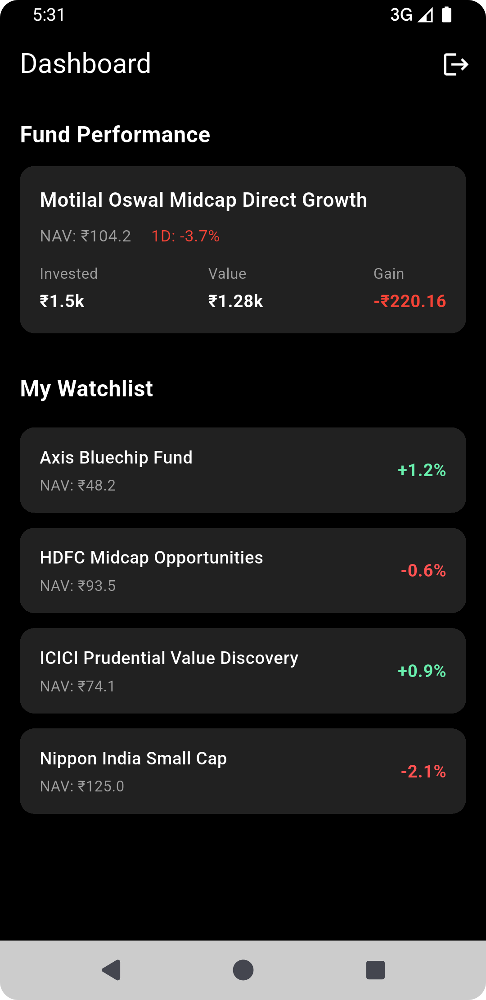
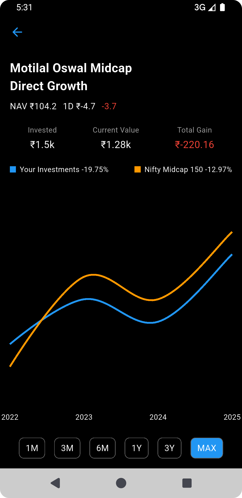

# 📈 Mutual Fund Portfolio  (Flutter App)

A beautifully crafted mutual fund dashboard app built using **Flutter**. This app demonstrates a smooth user experience for managing mutual fund portfolios, viewing fund performance, and exploring fund details with dynamic charts.

---
## Application Preview

| Dashboard                                      | Chart                                  |
|------------------------------------------------|----------------------------------------|
|  |  |


## ✨ Features

### 🔐 Supabase Authentication

- Email/Password sign-up and login flow
- Secure session management using Supabase Auth
- Realtime authentication state listener
- Placeholder screens ready for protected routes (e.g., Dashboard, Chart)

> Easily extensible to include social logins (Google, GitHub, etc.) with Supabase support

---

### 🧾 Mutual Fund Dashboard

Displays an overview of your portfolio and watchlist:

#### 1. Fund Performance (Detailed View)
- Shows a selected mutual fund’s performance
- NAV, 1D change, amount invested, current value, and gain/loss breakdown
- Styled with a dark theme and a clean card layout

#### 2. My Watchlist
- Scrollable list of added mutual funds
- Each fund shows:
    - Name
    - Current NAV
- Easily extensible for swipe actions, long press, or navigation to detail

---

### 📊 Mutual Fund Chart

A dedicated screen for visualizing mutual fund performance over time.

- Custom line chart with interactive time filters: `1M`, `3M`, `6M`, `1Y`, `3Y`, `MAX`
- Highlights:
    - Responsive chart rendering
    - NAV tracking and animated transitions
    - Dummy data currently used

---

## 📦 Tech Stack

- **Flutter**: UI & logic
- **Supabase**: Auth backend
- **fl_chart**: Line chart rendering

---

## 🛠 Getting Started

```bash
git clone https://github.com/alpeshshiyal/mutual_fund_portfolio_app.git
cd mutual_fund_portfolio_app
flutter pub get
flutter run
